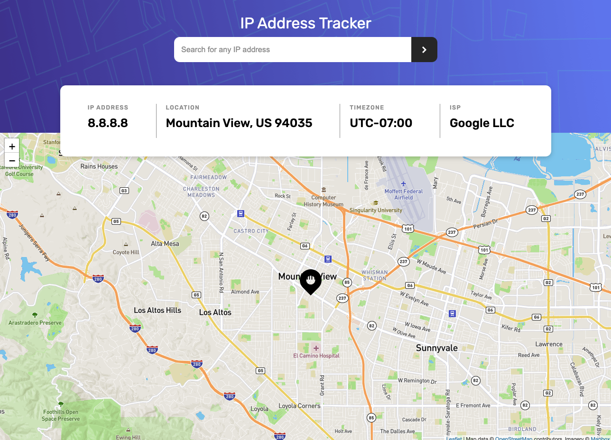
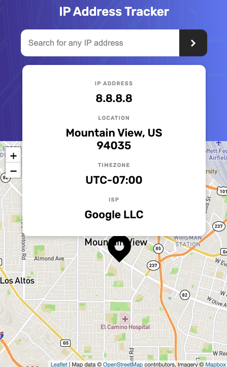

# ip-address-tracker

## Table of contents

- [Overview](#overview)
  - [Users should be able to](#users-should-be-able-to)
  - [Screenshot](#screenshot)
  - [Links](#links)
- [My process](#my-process)
  - [Built with](#built-with)
  - [Useful resources](#useful-resources)
- [Author](#author)

## Overview

### Users should be able to

- View the optimal layout for each page depending on their device's screen size
- See hover states for all interactive elements on the page
- See their own IP address on the map on the initial page load
- Search for any IP addresses and see the key information and location

### Screenshot

### Links

- Repo URL: [https://github.com/vanessasg/ip-address-tracker](https://github.com/vanessasg/ip-address-tracker)

## My process

### Built with

- HTML5 - CSS3 - JavaScript
- [geo.ipify](https://geo.ipify.org/) - IP Geolocation API
- [mapbox](https://docs.mapbox.com/) - Maps and location

### Useful resources

- In order to use [geo.ipify](https://geo.ipify.org/) and [mapbox](https://docs.mapbox.com/) cloning this repo, you should create your own API keys, simply logging in on their website, and replace YOUR-GEO-IPIFY-API-KEY and YOUR-MAPBOX-ACCESS-TOKEN with your keys.

## Author

- Website - [vanessasg](https://github.com/vanessasg)
